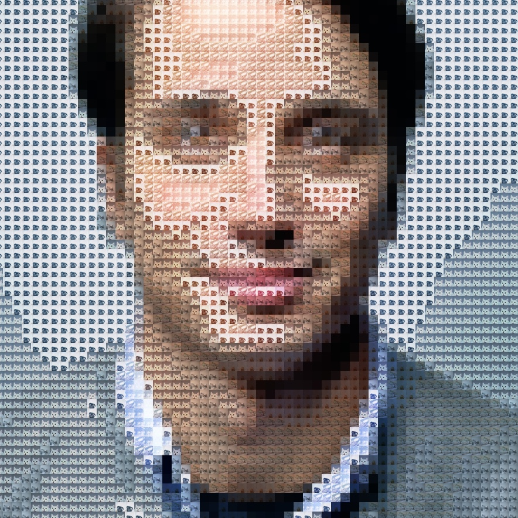

react-mosaic-app
==========

This React project is bootstrapped using [Vite](https://vitejs.dev/guide/).

# Motivation

This is a sample `image mosaic generator` and it is intended as a coding exercise.

There is no doubt that there is probably already existing better implementation in making `image mosaic` out there. But the goal of this project is to implement it based on my own understanding.

# Implementation

Just by looking at examples, the way I see it is the source image is broken down into blocks.
Each block is given a value and each value corresponds to some image.

Easy enough?

## The Plan

First, we load the image file into our `img` component.
The `img` component has `object-fit` set to `cover` so that any image will fit nicely.
Before we set it to the component, we needed to resize the image.

```javascript
const output_size = 256; // square image

const image_width = image.naturalWidth;
const image_height = image.naturalHeight;

let canvas = document.createElement('canvas');
canvas.width = output_size;
canvas.height = output_size;

let width = image_width;
let height = image_height;

let mode = image_width > image_height ? 1 : image_width < image_height ? 2 : 0;

if(image_width > image_height) {
        
    width = Math.round(output_size * (image_width/image_height));
    height = output_size;
      
} else {

    height = Math.round(output_size * (image_height/image_width));
    width = output_size;

}

var ctx = canvas.getContext("2d");

if(mode === 1) {
    
    var x = Math.round((image_width - image_height)/2);
    ctx.drawImage(image, x, 0, image_height, image_height, 0, 0, height, height);

} else if(mode === 2) {
    
    var y = Math.round((image_height - image_width)/2);
    ctx.drawImage(image, 0, y, image_width, image_width, 0, 0, width, width);

} else {

    ctx.drawImage(image, 0, 0, image_width, image_height, 0, 0, width, height);

}

```

Then we divide the image into smaller blocks.
Our `img` component has a nice power of two dimension so we can conveniently divide it equally.
Please note that the size of your blocks will affect the quality of the output.
The smaller the blocks, the more details can be shown.

Then we determine the `dominant RGB color` for each block.
I found a nice solution to get the `dominant RGB color` from this [article](https://dev.to/producthackers/creating-a-color-palette-with-javascript-44ip).

At this point, if we apply the `dominant RGB color` on each block, the resulting output resembles a pixelated version of the image.


Next, we get the equivalent `grayscale` value for each `dominant RGB color`.
The `grayscale` value will affect the output quality so I added a way to select different kinds of `grayscale` function that you can use.

```javascript
// Average
const gs_average = (red + green + blue) / 3;

// Lightness
const gs_lightness = (Math.max(red, green, blue) + Math.min(red, green, blue)) / 2;

// Luminosity
const gs_luminosity = 0.21 * red + 0.72 * green + 0.07 * blue;
```

The resulting output is like below:


Then we need to `normalize` the `grayscale` values based on how many images you will be using for `mosaic`.
I am using eight (8) images so:

```javascript
const delta = 255 / 8;

const level = Math.round(grayscale / delta);
const new_grayscale = delta * level;
```

The value of `level` will point to the corresponding image for mosaic.
If we apply the normalized `new_grayscale` value into the output, we will get something like:


You can compare and see the difference from the first grayscale image from above.
From this you can see that this part of the process also affects the output.

Finally, we put all of it together, we apply the `dominant RGB color` for each block's `background-color`, set the corresponding mosaic image in the `background-image` and set the `background-blend-mode` to `overlay`.




***Note: Stock photos used as sample images taken from [Unsplash](https://unsplash.com/photos/7YVZYZeITc8)*** 

## Using Color Palette

From [this](https://dev.to/producthackers/creating-a-color-palette-with-javascript-44ip) article, I was able to also get the color palette of the image. It gave me 16 different colors. I then sorted the colors by `luminance` and use it to set the image mosaic.

```javascript
const pixelData = ctx.getImageData(0, 0, canvas.width, canvas.height)

const rgbData = getRGB(pixelData.data)

const colorData = quantization(rgbData, 0)

const orderColors = orderByLuminance(colorData.slice(0))
```


I still divide the whole image into smaller blocks and get its dominant color like before.
Then I match dominant color to the palette by getting the difference and finding the smallest value.

```javascript
const d = calculateColorDifference(item, color)
```

# Moving Forward

* As of this time, the images used for the mosaic are located in `public` folder.
  In the future, it will be better to let user select the images themselves.
  If we do this, we need to get the color value of the image then sort all the images from dark to light.

* I think it is better to analyse the image and get it's histogram rather than just dividing 255 by the image count.
  That way we can eliminate background color and show more details in the output.

* It is also possible to just simply eliminate 0 (`black`) and 255 (`white`) and only set image from color values in between.

# Getting Started

Clone the repository, install the dependencies and run

```sh
$ git clone https://github.com/supershaneski/react-mosaic-app.git myproject

$ cd myproject

$ npm install

$ npm start
```

Your browser will open to `http://localhost:3005/` or some other port depending on the availability.
